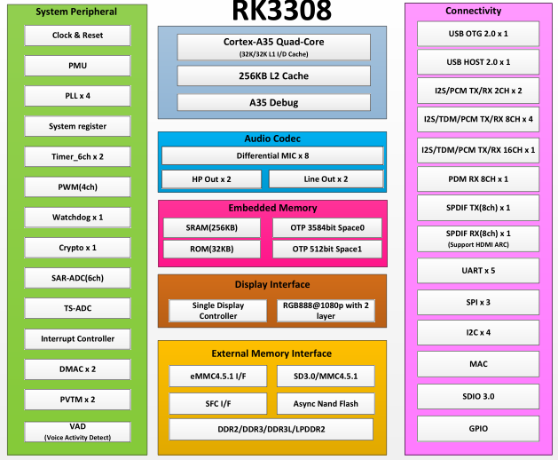

# [RK3308](https://github.com/mcuyun/RK3308) 

#### 归属：[cortex A35系列](https://github.com/mcuyun/CA35)
#### [关于悠云](https://github.com/mcuyun)可访问 www.mcuyun.com

## [简介](https://github.com/mcuyun/RK3308/wiki)

瑞芯微4核 A35 with 1.3GHz，主打语音，高度定制裁剪低成本方案

主要特点：5xUART、24 bit DAC、24 bit ADC

功能特点：Voice Activity Detection(VAD)

主要短板：只支持16bit DDR3 1066MHz，无图像输入输出

封装： TFBGA355 (13mm x 13mm; ball: 0.3mm pitch 0.65mm)

### [瑞芯微平台](https://github.com/mcuyun/rockchips)

平台相关资料

#### [linux系统](https://github.com/rockchip-linux/kernel.git)

开源Linux系统固件

#### [参考资料](docs/)

包括芯片相关资料

---

###  [悠云，为嵌入式](http://www.mcuyun.com)   
###  qitas@qitas.cn

